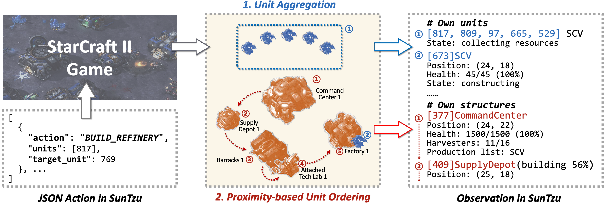
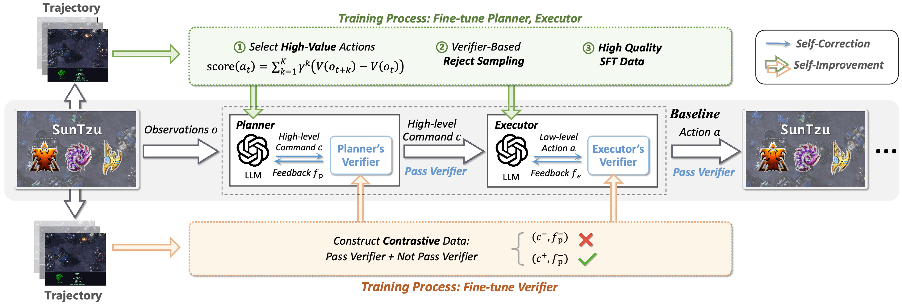
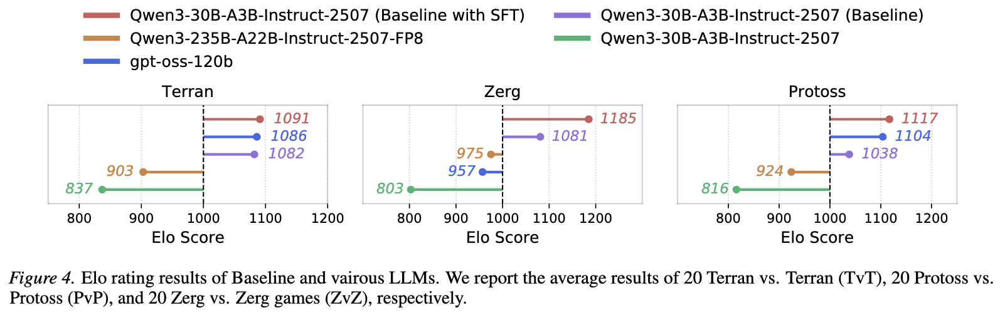

# SunTzu

Git Page: https://yorhaha.github.io/SunTzu/

### A Benchmark for Long-Horizon Decision-Making with LLMs in StarCraft II

SunTzu is a novel benchmark designed to evaluate Large Language Models (LLMs) in complex, long-horizon decision-making tasks. Built upon StarCraft II, it provides a comprehensive platform for testing strategic reasoning capabilities of LLMs in one of the most complex real-time strategy environments.

---

## 📖 Abstract

Recent advancements in decision-making algorithms, such as reinforcement learning (RL), have achieved significant breakthroughs in mastering precise control. However, these methods struggle with long-horizon decision-making tasks, which require strategic reasoning to break down into sub-tasks effectively.

Conversely, Large Language Models (LLMs), trained on vast corpora, have internalized high-dimensional abstractions of world knowledge, causal relationships, and logical laws, endowing them with powerful reasoning capabilities.

To bridge the gap between traditional decision-making algorithms and high-level strategic reasoning, we introduce **SunTzu**, a novel benchmark adapted for LLMs within the complex, long-horizon environment.

---

## ✨ Key Features

*   **Full-Length Game Context:** Supports complete gameplay scenarios spanning thousands of real-time decisions
*   **All Playable Races:** Full support for Terran, Protoss, and Zerg with unique mechanics
*   **Complete Low-Level Actions:** Preserves the game's original strategic depth and complexity
*   **Agent-vs-Agent Gameplay:** Enables direct competition and ELO-based ranking mechanisms
*   **Optimized Observations:** Proximity-based unit ordering and worker aggregation reduce information overload
*   **Hierarchical Self-Correction Framework:** Baseline algorithm with Planner, Executor, and Verifier modules
*   **Standardized JSON Interface:** Extensible and easy-to-use API for agent development

---

## 🏗️ Benchmark Design



SunTzu introduces two key techniques to address challenges in long-horizon decision-making:

1.  **Proximity-based Unit Ordering:** Enhances spatial reasoning via greedy nearest-neighbor unit ordering
2.  **Unit Aggregation:** Reduces information overload by aggregating redundant units

---

## 🤖 Method: Hierarchical Self-Correction Framework



The baseline algorithm employs a two-tier architecture:

*   **Planner:** Generates high-level strategic commands in natural language
*   **Executor:** Translates commands into executable low-level JSON actions
*   **Verifier:** Enables iterative self-correction for both modules

---

## 📊 Results



### Key Findings

1.  **Finding 1:** Due to cognitive overload, LLMs cannot be directly applied to long-horizon decision-making tasks.

2.  **Finding 2:** Hierarchical reasoning and observation optimization can enhance the reasoning capabilities of LLMs in long-horizon decision-making tasks.

3.  **Finding 3:** LLMs possess unique strategic reasoning capabilities and strong interpretability.

---

## 🚀 Getting Started

Follow these steps to set up your local environment and start experimenting.

### 1. Install StarCraft II 🎮

You need a local installation of the game. The free Starter Edition is sufficient.

*   **Windows / macOS:**
    1.  Download and install the game from the [official StarCraft II website](https://starcraft2.blizzard.com/).
    2.  (Optional but recommended) In the Battle.net launcher settings, change the game language to English.

*   **Linux:**
    1.  Download the Linux game package from the [s2client-proto repository](https://github.com/Blizzard/s2client-proto?tab=readme-ov-file#linux-packages).
    2.  Set the `SC2PATH` environment variable to your installation directory.
        ```bash
        export SC2PATH="/path/to/StarCraftII"
        ```

### 2. Set Up Game Maps 🗺️

1.  Download the `Melee` map pack from the [s2client-proto repository](https://github.com/Blizzard/s2client-proto?tab=readme-ov-file#map-packs).
2.  Create a `Maps` folder inside your StarCraft II installation directory.
3.  Unzip `Melee.zip` into the `Maps` folder.

### 3. Configure the Agent 🤖

1.  **Clone the repository and install dependencies:**
    ```bash
    git clone https://github.com/yorhaha/SunTzu.git
    cd SunTzu
    pip install -r requirements.txt
    ```

2.  **Configure API Keys:**
    ```bash
    cp .env_template .env
    ```
    Edit `.env` and add your LLM provider's API key and base URL.

---

## ▶️ Running a Battle

### LLMs-vs-Built-in AI

```bash
python main.py \
    --map_name Flat32 \
    --difficulty Hard \
    --model Qwen2.5-32B-Instruct \
    --ai_build RandomBuild \
    --enable_plan \
    --enable_plan_verifier \
    --enable_action_verifier \
    --own_race Terran \
    --enemy_race Terran
```

### Battle in ELO mode (LLMs-vs-LLMs)

```bash
python run_elo_template.py
```

---

## 📋 Evaluation Metrics

### Performance Metrics
| Metric | Description |
|--------|-------------|
| ELO | ELO Rating from agent-vs-agent matches |
| WR | Win Rate against built-in AIs |
| TCW | Time Cost of Winning |
| SBR | Supply Block Ratio |
| RUR | Resource Utilization Ratio |

### Efficiency Metrics
| Metric | Description |
|--------|-------------|
| TPD | Tokens Per Decision |
| VAR | Valid Action Ratio |

---

## 🤝 How to Contribute

Contributions are welcome! Whether it's adding a new agent, improving documentation, or fixing a bug, we appreciate your help.

1.  **Fork** the repository
2.  Create a new **branch** (`git checkout -b feature/your-feature-name`)
3.  Make your changes and **commit** them
4.  Push to your branch (`git push origin feature/your-feature-name`)
5.  Open a **Pull Request**

---

## 📄 Citation

```bibtex
@misc{shen2025sc2arenastarevolvebenchmarkselfimprovement,
      title={SC2Arena and StarEvolve: Benchmark and Self-Improvement Framework for LLMs in Complex Decision-Making Tasks}, 
      author={Pengbo Shen and Yaqing Wang and Ni Mu and Yao Luan and Runpeng Xie and Senhao Yang and Lexiang Wang and Hao Hu and Shuang Xu and Yiqin Yang and Bo Xu},
      year={2025},
      eprint={2508.10428},
      archivePrefix={arXiv},
      primaryClass={cs.LG},
      url={https://arxiv.org/abs/2508.10428}, 
}
```

---

## ⚖️ License

StarCraft II is a trademark of Blizzard Entertainment, Inc. This project is not affiliated with or endorsed by Blizzard Entertainment.
